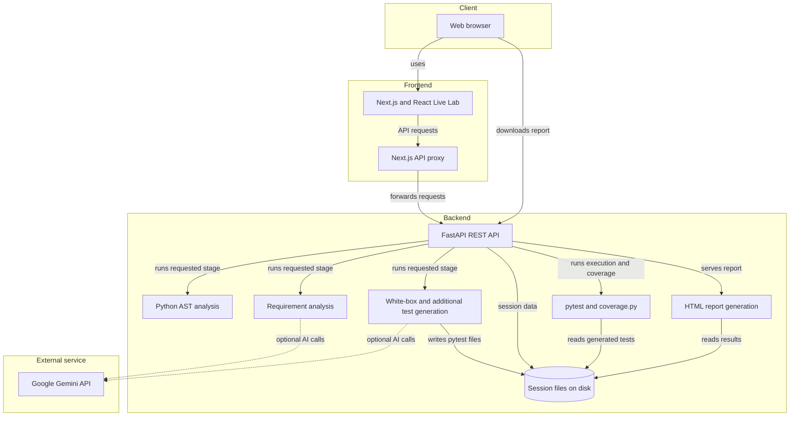
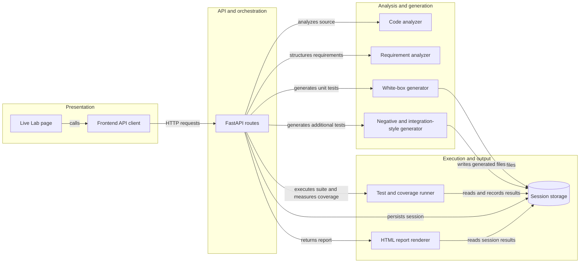
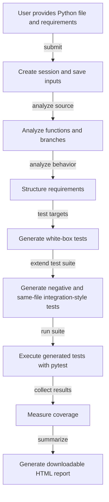

# AI-Assisted Intelligent Software Testing

An AI-assisted testing tool that analyzes a Python source file and natural-language requirements, generates tests, executes them, measures coverage, and produces a report.

> **Current scope:** The Live Lab currently works with one Python source file at a time. It primarily supports unit testing, with additional negative and limited integration-style tests for function interactions within that same file. GitHub repository testing and diagram-based requirements are future work.

## What the project does today

- Accepts a Python source file and requirements written in natural language.
- Analyzes Python functions and branches using the built-in AST module.
- Converts requirements into structured, traceable requirement records using Gemini when configured, with a heuristic fallback if the API key is unavailable.
- Generates white-box tests and additional negative and same-file integration-style tests.
- Executes generated tests with pytest and measures coverage with coverage.py.
- Stores run data in a session directory and generates a downloadable HTML report.

The current system does **not** fetch or test a GitHub repository, accept diagrams or flowcharts as requirements, or perform mutation testing.

## Architecture

The application has a Next.js frontend and a FastAPI backend. The backend coordinates analysis and test generation, stores each run in a session directory, invokes pytest and coverage.py, and renders the final report. Gemini is an optional external service for AI-assisted requirement and test generation.

<!-- mermaid-checked: no \n, no em-dash/en-dash, no {} in labels, subgraphs are id["label"], arrows are -->|"label"|, all subgraphs closed by end, ids unique -->


### Technology stack

| Layer | Technology | Purpose |
|---|---|---|
| Frontend | Next.js 13, React 18, TypeScript | Live Lab interface and API proxy |
| Backend | Python, FastAPI | Session and analysis API |
| Code analysis | Python AST | Extracts function and branch information |
| Requirement analysis | Google Gemini API, with heuristic fallback | Structures natural-language requirements |
| Test generation and execution | pytest | Generates and runs tests |
| Coverage | coverage.py | Measures test coverage |
| Reporting | Jinja2 and HTML | Builds downloadable session reports |
| Persistence | Session files on disk | Stores source, requirements, generated tests, and results |
| Frontend checks | Playwright | Smoke-tests the frontend and backend health integration |

There is no database in the current workflow. Session data is saved under `backend/sessions/`. Gemini is optional for requirement analysis; without a configured key, a heuristic parser is used. Some test-generation paths also include fallback behavior.

### Component relationships

<!-- mermaid-checked: no \n, no em-dash/en-dash, no {} in labels, subgraphs are id["label"], arrows are -->|"label"|, all subgraphs closed by end, ids unique -->


## Workflow

The Live Lab calls the backend in stages. Users can edit the source and requirements in the interface or upload a `.py` file.

<!-- mermaid-checked: no \n, no em-dash/en-dash, no {} in labels, subgraphs are id["label"], arrows are -->|"label"|, all subgraphs closed by end, ids unique -->


Generated additional integration-style tests currently target interactions between functions in the uploaded source file. This does not represent integration testing across a full repository.

## Running locally

You need Python and Node.js/npm installed.

### 1. Configure the backend

From the repository root, create and activate a virtual environment, then install the backend requirements:

```powershell
py -m venv venv
.\venv\Scripts\Activate.ps1
pip install -r backend\requirements.txt
```

Optionally copy `backend\.env.example` to `backend\.env` and set your Gemini API key:

```env
GEMINI_API_KEY=your_key_here
```

Do not commit `.env` files or API keys. If the key is not configured, requirement parsing uses a heuristic fallback.

Start the backend from the `backend` directory:

```powershell
cd backend
..\venv\Scripts\python.exe -m uvicorn app:app --reload --port 8000
```

### 2. Start the frontend

In another terminal, from the repository root:

```powershell
cd frontend
npm install
npm run dev
```

Open [http://localhost:3000/live-lab](http://localhost:3000/live-lab). By default, the Next.js app forwards `/api/*` requests to `http://127.0.0.1:8000`. Set `API_PROXY_TARGET` if the backend runs at a different address.

Run an analysis in the Live Lab, then view or download the generated report from the results/dashboard flow.

## Tests

Run backend tests from the repository root:

```powershell
Set-Location backend
..\venv\Scripts\python.exe -m pytest -q
```

Frontend Playwright smoke tests are available in the `frontend` directory:

```powershell
npm run test:e2e:smoke
```

The smoke tests check basic frontend pages and can check backend health when the backend is available.

## Future scope

These are planned extensions, not features in the current user-facing workflow:

- **GitHub-based repository integration testing:** Allow a user to provide a GitHub repository link so the system can analyze project modules and generate tests across component boundaries. Repository access and safe execution need to be addressed.
- **Diagram and flowchart requirements:** Allow users to provide diagrams or flowcharts, interpret them as behavioral scenarios, and generate tests from the resulting structured requirements.
- **Jev semantic UI testing:** The repository contains an internal Jev prototype, but it is not part of the current demo or user-facing workflow.
- **Broader testing improvements:** Additional languages, mutation testing, and coverage-guided iterative test refinement may be considered as future work.

## Project status

This project is being developed as a final-year B.Tech major project by a team of three students. The current prototype focuses on Python source analysis and unit-test generation.
